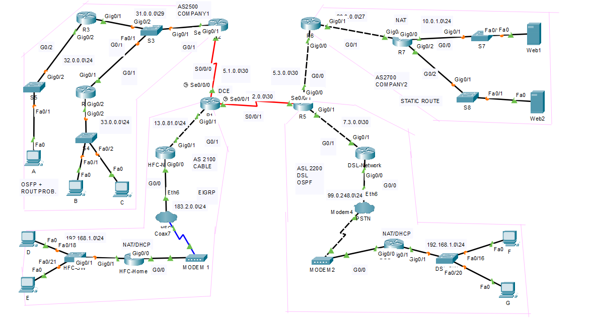

# VPN Implementation for Corporate Sites

## Project Overview
This project establishes a secure and optimized network connecting two corporate sites (**Company 1 - AS2500** and **Company 2 - AS2700**) using an **IPSec VPN tunnel**. The network design incorporates **dynamic and static routing, NAT, DHCP, ACLs, and BGP** to ensure **security, scalability, and efficient traffic management**.  

Additionally, two remote sites (**HFC and DSL networks**) are included to simulate **branch offices or home users connecting via broadband (cable/DSL)**.  

## Objectives
- Establish a **secure site-to-site VPN** between **Company 1 (R2, AS2500)** and **Company 2 (R6, AS2700)**.  
- Implement **dynamic routing protocols (OSPF, EIGRP, and BGP)** for optimal path selection.  
- Configure **NAT (Static and Dynamic)** for internal-external IP translation.  
- Automate **IP address allocation via DHCP** for select devices.  
- Implement **Access Control Lists (ACLs)** to restrict unauthorized access.  
- Simulate the network using **Cisco Packet Tracer**.  


## Network Topology




- **Site A:** 
  - **Router R1**
    - Interface Serial0/0/0: IP address 5.1.0.1 255.255.255.252
    - Interface GigabitEthernet0/1: IP address 13.0.81.1 255.255.255.0
  - **Router R2**
    - Interface Serial0/0/0: IP address 5.1.0.2 255.255.255.252
    - Interface GigabitEthernet0/1: IP address 32.0.0.1 255.255.255.0
  - **Router R3**
    - Interface Serial0/0/0: IP address 5.1.0.2 255.255.255.252
    - Interface GigabitEthernet0/2: IP address 32.0.0.10 255.255.255.0
  - **Router R4**
    - Interface GigabitEthernet0/2: IP address 33.0.0.1 255.255.255.0
  - **Router R5**
    - Interface Serial0/0/0: IP address 7.3.0.2 255.255.255.252

- **Site B:**
  - **Router R6**
    - Interface GigabitEthernet0/0: IP address 5.3.0.2 255.255.255.252
    - Interface GigabitEthernet0/1: IP address 20.0.0.1 255.255.255.224
  - **Router R7**
    - Interface GigabitEthernet0/0: IP address 10.0.1.1 255.255.255.0
    - Interface GigabitEthernet0/2: IP address 10.0.2.1 255.255.255.0

#### **Remote Site 1 – HFC Network (AS2100)**
- **Represents**: Broadband ISP using **Hybrid Fiber-Coaxial (HFC)** technology.  
- **Routing Protocol**: EIGRP  
- **Routers**: HFC-Home, HFC-Network  
- **Key Features**: Provides **DHCP, NAT, and restricted access control** for remote users.  

#### **Remote Site 2 – DSL Network (AS2200)**
- **Represents**: A branch office or remote workers connecting via **DSL broadband**.  
- **Routing Protocol**: OSPF  
- **Routers**: DSL-Home, DSL-Network
- **Key Features**: Acts as an edge network with **NAT, ACLs, and DHCP** for internal clients.  


- **Additional Components:**
  - **Switches:**
    - Cisco Catalyst 2960 or 3650 Series
  

## **Protocols & Technologies**  
| **Protocol** | **Purpose** |
|-------------|------------|
| **IPSec VPN** | Secure encrypted tunnel between Company 1 and Company 2. |
| **OSPF** | Dynamic routing in AS2500 & AS2200. |
| **EIGRP** | Routing for HFC network (AS2100). |
| **BGP** | Route advertisement between ASes. |
| **NAT (Static & Dynamic)** | Public-private IP translation. |
| **DHCP** | Automatic IP allocation for PCs & remote users. |
| **ACLs** | Network access control & security policies. |


## Implementation Steps

1. **Define Requirements**
   - Determine the purpose and requirements for the VPN connection (bandwidth, security, availability).

2. **Choose VPN Protocol**
   - Select IPsec for the site-to-site VPN.

3. **Select VPN Devices**
   - Use appropriate devices for each site, such as Cisco routers or firewalls (e.g., Cisco ASA).

4. **Configure the VPN Gateway**
   - Set up the VPN gateways on both sites with the IPsec settings.

5. **Enable OSPF**
   - Configure OSPF on routers for dynamic routing between the sites.

6. **Set Up DHCP**
   - Configure DHCP on routers or dedicated DHCP servers to automatically assign IP addresses to network devices.
   - Define DHCP pools for each VLAN.

7. **Implement ACLs**
   - Configure ACLs to control access to the network and enhance security.
   - Examples:
     - Ban anyone not belonging to the HFC network from accessing router HFC-Network via Telnet.
     - Ban computers in the 33.0.0.0/24 network from browsing the web but allow all other communication.

8. **Test and Monitor**
    - Verify connectivity, test the VPN tunnel, and monitor performance and availability.

## Simulation Using Cisco Packet Tracer
- **Purpose:** Use Cisco Packet Tracer to simulate the network setup and configurations.
- **Application:** Create a virtual network topology in Packet Tracer, configure the protocols and devices, and test the connectivity and performance.

## Example Configuration
### Site A Configuration
```plaintext
! Site A Configuration
crypto isakmp policy 1
 authentication pre-share
 encryption aes
 hash sha
 group 2
 lifetime 86400
crypto isakmp key YOUR_SHARED_KEY address SITE_B_IP
crypto ipsec transform-set MY_TRANSFORM_SET esp-aes esp-sha-hmac
crypto map MY_CRYPTO_MAP 10 ipsec-isakmp
 set peer SITE_B_IP
 set transform-set MY_TRANSFORM_SET
 match address VPN_ACL
interface GigabitEthernet0/0
 ip address SITE_A_IP 255.255.255.0
 crypto map MY_CRYPTO_MAP
access-list VPN_ACL permit ip SITE_A_NETWORK 0.0.0.255 SITE_B_NETWORK 0.0.0.255
! DHCP Configuration
ip dhcp pool VLAN10
 network 192.168.10.0 255.255.255.0
 default-router 192.168.10.1
 dns-server 8.8.8.8
ip dhcp pool VLAN20
 network 192.168.20.0 255.255.255.0
 default-router 192.168.20.1
 dns-server 8.8.8.8
```
### Site B Configuration
```plaintext
! Site B Configuration
crypto isakmp policy 1
 authentication pre-share
 encryption aes
 hash sha
 group 2
 lifetime 86400
crypto isakmp key YOUR_SHARED_KEY address SITE_A_IP
crypto ipsec transform-set MY_TRANSFORM_SET esp-aes esp-sha-hmac
crypto map MY_CRYPTO_MAP 10 ipsec-isakmp
 set peer SITE_A_IP
 set transform-set MY_TRANSFORM_SET
 match address VPN_ACL
interface GigabitEthernet0/0
 ip address SITE_B_IP 255.255.255.0
 crypto map MY_CRYPTO_MAP
access-list VPN_ACL permit ip SITE_B_NETWORK 0.0.0.255 SITE_A_NETWORK 0.0.0.255
! DHCP Configuration
ip dhcp pool VLAN10
 network 192.168.10.0 255.255.255.0
 default-router 192.168.10.1
 dns-server 8.8.8.8
ip dhcp pool VLAN20
 network 192.168.20.0 255.255.255.0
 default-router 192.168.20.1
 dns-server 8.8.8.8
 ```

### **Lab Setup**
## 1. hostnames on all routers
```
Router(config)#hostname R1
```

### 2. **Set up HFC and PSTN clouds**
- **HFC Cloud:**
1. Go to the "Config" tab, find "Ethernet6" under "INTERFACES" and select "Cable".
2. Connect "Coaxial7" and "Ethernet6", and click "Add".

- **DSL Cloud:**
Follow a similar configuration to the HFC cloud.

- **PSTN Cloud:**
1. Go to the "Config" tab, find "Modem4" under "INTERFACES" and connect it to "Ethernet6".

### 3. **IP addressing**
- **Static IP addressing on router interfaces:**
```plaintext
R1(config)#interface Serial0/0/0
R1(config-if)#clock rate 4000000
R1(config-if)#ip address 5.1.0.1 255.255.255.252
R1(config-if)#no shutdown
```

- **Static IP addressing on PCs and servers:**
- Use the IP Configuration tab on each device's Desktop.

### 4. **Dynamic NAT on routers HFC-Home and DSL-Home**
```plaintext
HFC-H(config)#ip access-list standard 1
HFC-H(config-std-nacl)#permit 192.168.1.0 0.0.0.255
HFC-H(config)#ip nat inside source list 1 interface GigabitEthernet0/0 overload
HFC-H(config)#interface GigabitEthernet0/0
HFC-H(config-if)#ip nat outside
HFC-H(config)#interface GigabitEthernet0/1
HFC-H(config-if)#ip nat inside
```

### 5. **Static NAT on Router R7**
```plaintext
R7(config)#ip nat inside source static 10.0.1.1 20.0.0.3
R7(config)#ip nat inside source static 10.0.1.2 20.0.0.4
R7(config)#ip nat inside source static 10.0.2.1 20.0.0.5
R7(config)#ip nat inside source static 10.0.2.2 20.0.0.6
R7(config)#ip nat inside source static 10.0.2.3 20.0.0.7
R7(config)#interface GigabitEthernet0/0
R7(config-if)#ip nat inside
R7(config)#interface GigabitEthernet0/2
R7(config-if)#ip nat inside
R7(config)#interface GigabitEthernet0/1
R7(config-if)#ip nat outside
```

### 6. Routing
## AS 2500: OSPF + Route Propagation
```plaintext
R2(config)#ip route 0.0.0.0 0.0.0.0 Serial 0/0/0
R2(config)#router ospf 1
R2(config-router)#network 31.0.0.0 0.0.0.7 area 0
R2(config-router)#default-information originate

R3(config)#router ospf 1
R3(config-router)#network 31.0.0.0 0.0.0.7 area 0
R3(config-router)#network 32.0.0.0 0.0.0.255 area 0

R4(config)#router ospf 1
R4(config-router)#network 31.0.0.0 0.0.0.7 area 0
R4(config-router)#network 33.0.0.0 0.0.0.255 area 0
```

## AS 2700: Static Routing
```plaintext
R7(config)#ip route 0.0.0.0 0.0.0.0 GigabitEthernet 0/1

## AS 2100: EIGRP + Static Routes
```plaintext
HFC-H(config)#ip route 0.0.0.0 0.0.0.0 GigabitEthernet 0/0
HFC-H(config)#router eigrp 2100
HFC-H(config-router)#no auto-summary
HFC-H(config-router)#network 183.2.0.0 0.0.0.255

HFC-N(config)#ip route 0.0.0.0 0.0.0.0 GigabitEthernet 0/1
HFC-N(config)#router eigrp 2100
HFC-N(config-router)#no auto-summary
HFC-N(config-router)#network 183.2.0.0 0.0.0.255
HFC-N(config-router)#network 13.0.81.0 0.0.0.255

R1(config)#router eigrp 2100
R1(config-router)#no auto-summary
R1(config-router)#network 13.0.81.0 0.0.0.255
```

## AS 2200: OSPF + Route Propagation
```plaintext
DSL-N(config)#ip route 0.0.0.0 0.0.0.0 GigabitEthernet 0/1
DSL-N(config)#router ospf 1
DSL-N(config-router)#default-information originate
DSL-N(config-router)#network 7.3.0.0 0.0.0.3 area 0
DSL-N(config-router)#network 99.0.248.0 0.0.0.255 area 0

R5(config)#router ospf 1
R5(config-router)#network 7.3.0.0 0.0.0.3 area 0

DSL-H(config)#router ospf 1
DSL-H(config-router)#network 99.0.248.0 0.0.0.255 area 0
DSL-H(config-router)#network 192.168.1.0 0.0.0.255 area 0
```

### **VPN Configuration (R2 ↔ R6)**
#### **On Router R2 (Company 1)**
```plaintext
crypto isakmp policy 10
 authentication pre-share
 encryption aes
 hash sha
 group 2
 lifetime 86400
crypto isakmp key MY_SHARED_KEY address 20.0.0.1
crypto ipsec transform-set VPN-SET esp-aes esp-sha-hmac
crypto map VPN-MAP 10 ipsec-isakmp
 set peer 20.0.0.1
 set transform-set VPN-SET
 match address VPN-ACL
interface GigabitEthernet0/2
 crypto map VPN-MAP
access-list 100 permit ip 32.0.0.0 0.0.0.255 10.0.1.0 0.0.0.255
```
On Router R6 (Company 2)
```
crypto isakmp policy 10
 authentication pre-share
 encryption aes
 hash sha
 group 2
 lifetime 86400
crypto isakmp key MY_SHARED_KEY address 31.0.0.1
crypto ipsec transform-set VPN-SET esp-aes esp-sha-hmac
crypto map VPN-MAP 10 ipsec-isakmp
 set peer 31.0.0.1
 set transform-set VPN-SET
 match address VPN-ACL
interface GigabitEthernet0/0
 crypto map VPN-MAP
access-list 100 permit ip 10.0.1.0 0.0.0.255 32.0.0.0 0.0.0.255
```

## Conclusion

This project successfully implemented a secure, scalable, and efficient network connecting two corporate sites and two remote locations. By integrating IPSec VPN, dynamic routing, NAT, DHCP, and ACLs, we ensured security, performance, and reliability for business operations.

